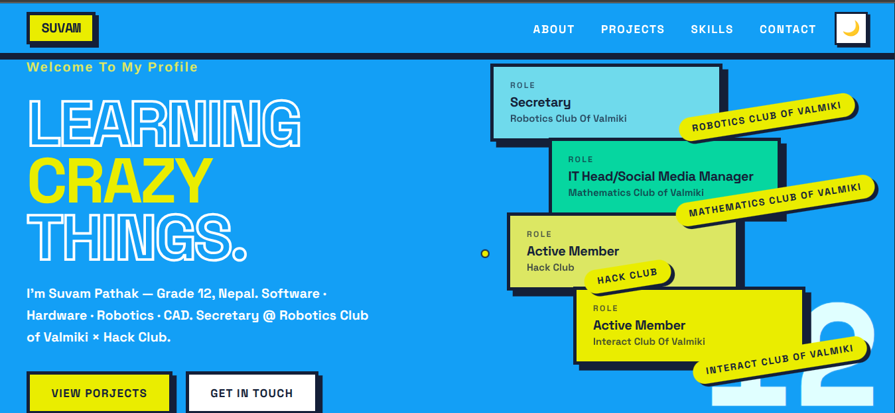
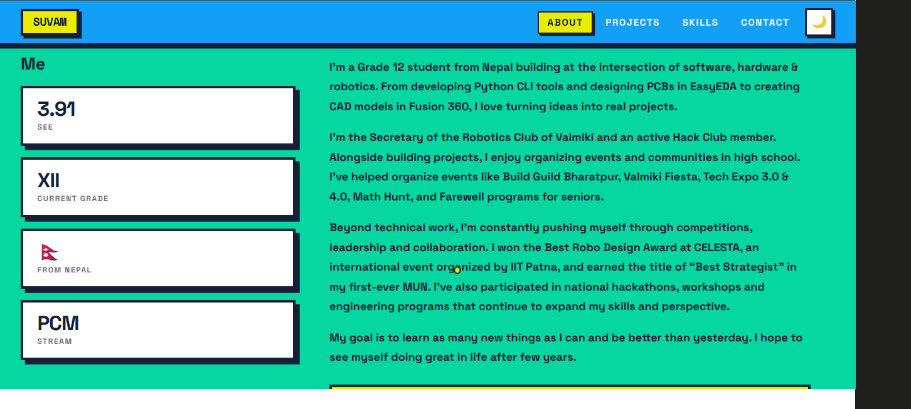
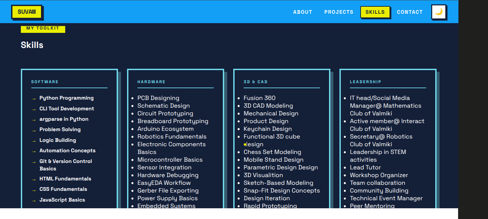
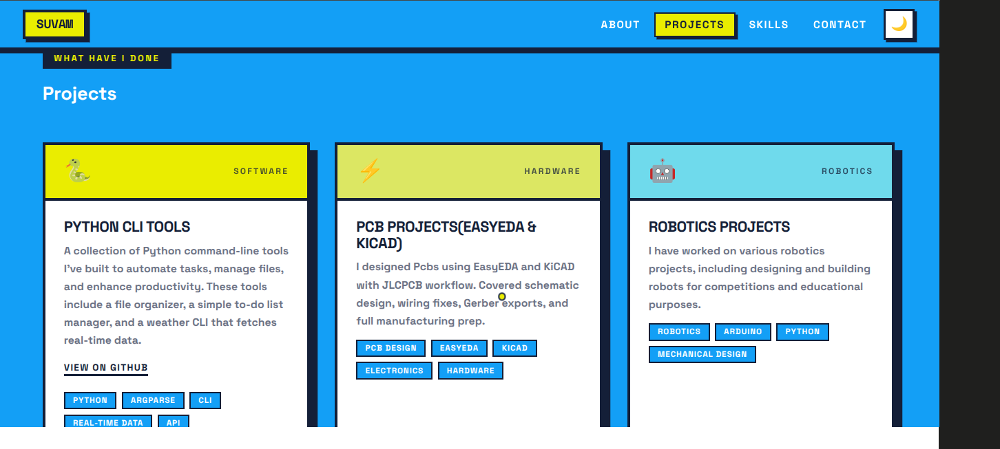
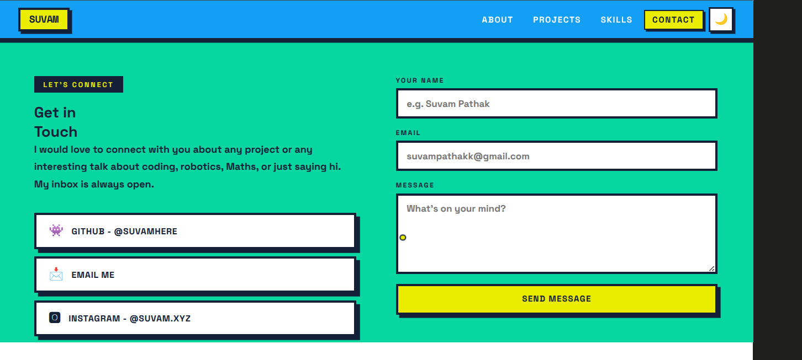
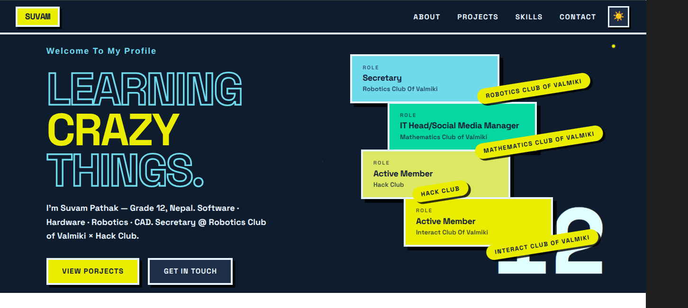

**PortSite**

# Suvam Pathak- Portfolio

### A personal website built to showcase who I am, What have I done, and What are my interests. I started this project because I wanted a place to display my projects, skills, and experiences while learning web development by building something real and impactful.This project's color palette is inspired by an animated series called 'Invincible'.

### This website is of 5 sections

## 1.[Home](#-Home)

## 2.[About](#-About)

## 3.[Skills](#-Skills)

## 4.[Projects](#-Projects)

## 5.[Contact](#-Contact)

-------------------------------

# Hero 

### The first thing users see is a boot screen which is inspired by old terminal startup sequences. A loading counter,progress bar, and animated elements play before revealing the main home page. The hero section introduces who I am and highlights some of the clubs I'm involved with.

# About

### A short overview of who I am, What I have worked on, and what I wan to pursue in the future. It also includes a few quick stats and information about what I'm currently learning and building.

#Skills

### This section contains the technologies, tools, and areas I have experiences with, including programming, electronics, CAD,3D Modeling,Robotics,and leadership activities.

#Projects

### A collection of projects that best represent my interests and skills, These include software projects, electronics work,PCB design,CAD models,and other things I've built through school,Hack Club, and personal learning.

#Contact

### A simple Contact section where visitors can reach out through email or social platforms. It also includes a contact form with input validation.

#Other Features

## Boot screen
## Dark Mode
## Scroll Animations
## Active Navigation highlight
## Smooth Scrolling
## Sticky Navigation 

## 1.Boot screen
### A custom startup screen with a loading counter and progress animation before the website becomes visible.

## 2.Dark Mode

### Light and Dark themes can be switchedd instantly where the light mode is what is normally seen and in dark mode the color changes to darker shade of blue where minimalist design is there.

## 3.Scroll Animations
### Different elements animate into view as the user scrolls through the website.

## 4.Active Navigation highlight
### The navigation bar automatically highlights the section currently being viewed.

## 5.Smooth Scrolling
### Navigation links smoothly to the correct section without abrupt jumps.

## 6.Sticky Navigation
### The navigation bar remains visible while scrolling for easier access around the website.

#What I Learned
###Building this Portfolio helped me learn responsive layouts,CSS Grid, flexbox and some decent animations. This project was a confidence booster in my jounrney. I always wanted a portfolio website of mine and this made the dream comes true, not only the UI is something I will want to see but the process to get here aspires me to do more projects using the knowledge gained by this project.

#Teck Stack
* HTML
* CSS
* JavaScript
* GitHub Pages

### Built by pure hand using HTML,CSS and JS with somewhat help of AI while debugging

###Thank you for time!
